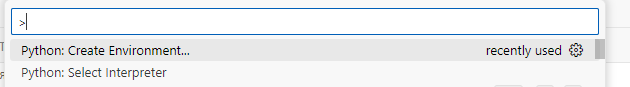
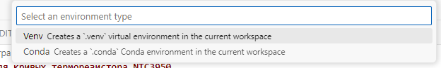
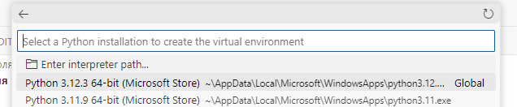
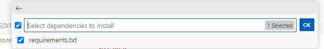

# Это интерполятор для кривых терморезистора NTC3950

Впрочем, его можно использовать успешно и для других терморезисторов.

# Уравнение Стейнхарта-Харта

Уравнение [Стейнхарта-Харта](https://ru.wikipedia.org/wiki/Уравнение_Стейнхарта_—_Харта) ([Steinhart–Hart](https://en.wikipedia.org/wiki/Steinhart%E2%80%93Hart_equation))  математическая модель, описывающая сопротивление полупроводниковых терморезисторов с отрицательным температурным коэффициентом электрического сопротивления в зависимости от температуры.

Обычно, это уравнение описывают так:


И обычно ограничиваются тремя точками при интерполяции этой кривой. Однако, точность при этом очень сильно страдает. Незначительная ошибка при считывании параметров одной из точек сдвинет график вниз или вверх.

Стоит использовать библиотеку python [scipy](https://scipy.org/). Это значительно повышает рассчёт точности полученных коэффициентов уравнения, что видно на пробном графике сравнения экспериментальной кривой и кривой полученной в результате интерполяции

Не забываем, что температура в уравнении в K&deg;. Т.е., к значению по цельсию надо прибавить ~ 273.15

Поскольку, в уравнении, 1/T, интерполируем именно значение 1/T.

# Формат исходного файла:

Либо, *.csv файл, либо *.xlsx. 

```csv
# R	T
0.609	205
0.65	204
0.679	203
0.691	202
0.725	201
0.738	200
0.646	198
0.673	196
0.687	195
0.706	194
0.728	192
0.751	191
0.756	190
0.797	188
... ...
```

Первый лист, первая колонка &mdash; температура в С°

Первый лист, вторая колонка &mdash; сопротивление в Омах


# Запуск программы

В директории с программой запустить
```cmd
pip install -r /path/to/requirements.txt
```

Или в VSCode F1, (Ctrl+Shit+P), >Python: Create Environment



> &gt; Python: Create Virtual Environment



> &gt; Python: Select Interpreter



> &gt; Using requirements.txt



Наблюдаем за установкой пакетов

